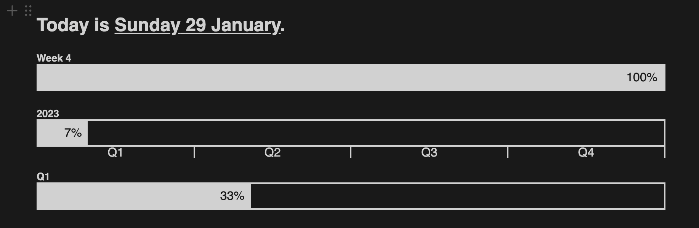

# dannyspina.com

## 📝 Notion Widgets

Under `/notion` are located the notion widgets.

The currently available widgets are:

  
📅 Week Info (<code>/notion/weekinfo</code>)

Information about the current day, week, year and quarter:

---