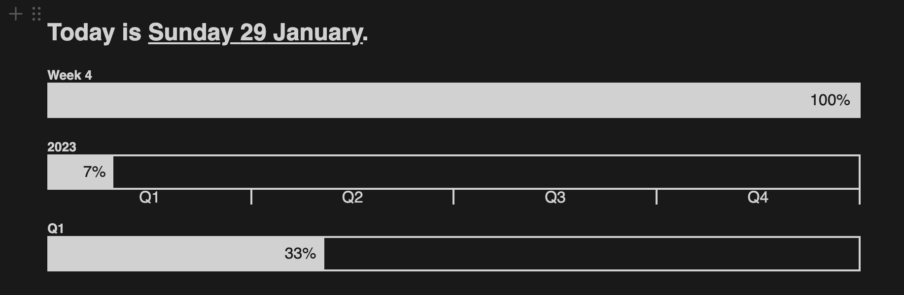

# dannyspina.com

Personal site and workshop of Danny Spina — services, writing, book notes and a podcast archive.
Statically prerendered SvelteKit site, deployed on Netlify.

## Stack

| Piece     | Choice                                                              |
| --------- | ------------------------------------------------------------------- |
| Framework | SvelteKit 2 on Svelte 5                                             |
| Output    | `@sveltejs/adapter-static` — fully prerendered (`prerender = true`) |
| Markdown  | mdsvex (`.md` files are routes)                                     |
| Styling   | SCSS + CSS custom-property tokens (`src/lib/styles/tokens.css`)     |
| Fonts     | JetBrains Mono + Montserrat (self-hosted), Archivo (Google Fonts)   |
| Tooling   | Vite 8, TypeScript, ESLint, Prettier, `svelte-check`                |
| Analytics | Tiny Analytics (script in `src/app.html`)                           |
| Forms     | Netlify Forms                                                       |
| Hosting   | Netlify, Node pinned to 20.20.0 (`.nvmrc` + `netlify.toml`)         |

No Tailwind, no CSS framework. The design system is "Sistema 2b" — a technical-sheet /
graphite look defined by the tokens file and a small set of components (`SpecTable`,
`ServiceSheet`, `RulerDivider`, `PostCard`).

## Getting started

```bash
nvm use          # 20.20.0
npm install
npm run dev      # vite dev --host
```

| Script            | What it does                                                |
| ----------------- | ----------------------------------------------------------- |
| `npm run dev`     | Dev server                                                  |
| `npm run build`   | `vite build` — prerenders every route to `build/`           |
| `npm run preview` | Serves the built output                                     |
| `npm run check`   | `svelte-check` against `tsconfig.json`                      |
| `npm run lint`    | `prettier --check` + `eslint` (also enforced on Netlify CI) |
| `npm run format`  | `prettier --write .`                                        |

`postbuild` runs `svelte-sitemap` against `https://dannyspina.com`, excluding `/library`,
`/meet` and `/books/**`.

## Layout

```
src/
├── app.html              theme bootstrap, analytics, favicons, Archivo font
├── store.ts              back-arrow scroll state
├── lib/
│   ├── siteConfig.ts     SITE_URL, defaults, absoluteUrl() helper
│   ├── components/       design-system + content components (Seo, SpecTable, …)
│   ├── helpers/          post sorting, types, Calendar (Notion widget)
│   └── styles/           tokens.css, style.scss, variables.scss
└── routes/
    ├── +page.svelte      homepage: services, service log, latest posts
    ├── about/ ai/ workshop/ contacts/
    ├── services/{design-ops,frontend-design-systems,software-development}/
    ├── blog/             "The log" index + one folder per post + /categories/[category]
    ├── archive/          entries retired from the log (noindex) + one folder each
    ├── books/            reading log (noindex) + one folder per book
    ├── asincrono/        podcast index + [episode]
    ├── notion/weekinfo/  embeddable Notion widget
    ├── api/              posts.json, archive.json, books.json, episodes.json
    └── rss.xml/          hand-rolled RSS 2.0 feed (blog posts only)

scripts/
├── blog_cli.cjs          content scaffolding CLI
└── og_image.html         template to screenshot for static/og-default.png (1200×630)
```

## Content

Everything is markdown in the routes tree — `+page.md` inside a folder named after the slug.

**Blog post** — `src/routes/blog/<slug>/+page.md`

```yaml
---
title: NPMGuard
subtitle: A tool to identify weakness in your package.json
date: "2025-03-20"
categories:
  - "Projects"
human: 90 # optional 0–100, drives the AiIndicator badge (see /ai)
---
```

Posts can import `ImagePost`, `Gallery`, `Sidenote` and `Callout` in a `<script>` block.
Images go in `static/images/blog/<slug>/`.

**Book note** — `src/routes/books/<slug>/+page.md`

```yaml
---
title: Dopamine Nation
author: Anna Lembke
amazonLink:
category: Personal Growth
description: >-
  Used as the SEO description.
---
```

The whole `/books` section is `noindex` and excluded from the sitemap.

**Archived entries** — `src/routes/archive/<slug>/+page.md`, same frontmatter as a blog post.

The archive holds writing that is kept but no longer circulated: old experiments, the weekly
retros, and posts that stopped holding up. Retiring an entry is a single move —
`git mv src/routes/blog/<slug> src/routes/archive/<slug>` — because `/api/posts.json` globs
only `src/routes/blog/**`, so the entry leaves the log index, the categories, the RSS feed,
the `LOG·NNN` numbering and the prev/next links on its own. There is no exclusion list.

Every archive page renders `noindex`, the section is disallowed in `robots.txt` and ignored
by the sitemap, and nothing on the site links into it. **Add a 301 in `netlify.toml`** when
you move something, so the old `/blog/<slug>` URL still resolves.

**Podcast episodes** are not files — `/api/episodes.json` parses the Anchor.fm RSS at build
time, so new episodes only appear after a rebuild. `.github/workflows/rss-check.yml` runs
weekly (Sunday 00:00 UTC), diffs the feed against `.last-episode`, and pings the
`NETLIFY_BUILD_HOOK` secret when something changed.

### Authoring CLI

```bash
node ./scripts/blog_cli.cjs new-post   # scaffolds src/routes/blog/<slug>/+page.md
                                       # + static/images/blog/<slug>/, branches to blog_<slug>
node ./scripts/blog_cli.cjs new-book   # scaffolds src/routes/books/<slug>/+page.md
```

Handy alias for `~/.zshrc`:

```bash
alias blog='node ~/<path-to-this-repo>/scripts/blog_cli.cjs'
```

## SEO

`src/lib/components/Seo.svelte` is the single entry point, used by every page: title, meta
description, canonical (skipped when `noindex`), Open Graph, Twitter cards and JSON-LD.
It builds `BlogPosting` automatically for `type="article"` and merges any `schema` prop —
that's how the homepage gets `Person`/`WebSite` and the service pages get `Service`.
Defaults live in `src/lib/siteConfig.ts`.

## Deployment

Netlify builds from the default branch. `netlify.toml` pins Node and holds the 301
redirects: two shortlinks (`/library` → Drive folder, `/meet` → Jit.si room), the removed
`/archive/*` weeklies → `/blog`, and three renamed post slugs. Keep a redirect here
whenever a slug changes. The contact form uses Netlify Forms with a honeypot and redirects
to `/contacts/thanks`.

## Notion widgets

`/notion/weekinfo` renders progress bars for the current day, week, quarter and year —
meant to be embedded in Notion. It's excluded from the site chrome and from `robots.txt`.



## Notes and rough edges

- **Markdown only lives under `blog/` or `books/`.** mdsvex has no fallback layout, so a
  `.md` file anywhere else will fail to resolve one. Add a named layout in
  `svelte.config.js` first if you need a third content type.
- **The site is dark only.** There is no theme toggle; `app.html` reads `localStorage.theme`
  and falls back to dark. `tokens.css` still carries a light palette if it's ever wired up.
- `rss-check.yml` still uses the deprecated `::set-output` syntax, so the Netlify rebuild
  step may silently never fire. Worth verifying before trusting the podcast auto-sync.
- The codebase runs on Svelte 5 but is written in legacy `export let` / `$:` syntax, not runes.
